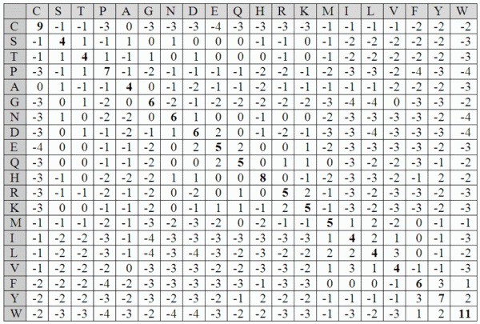

# Working on Collaborative Coding Projects with Git and GitHub
*8CC00 - Advanced Programming and Biomedical Data Analysis*

Max de Rooij - Eindhoven University of Technology - 2024

## Introduction
Git is a distributed version control system that is widely used in software 
development. GitHub is a web-based platform that provides hosting for Git 
repositories. This practical will guide you through the basic steps of using 
Git and GitHub in a collaborative project. Within the time frame of this 
practical, we will not be able  to cover all the features of Git and GitHub. 
However, we will cover the basic features that are essential for collaborative 
projects and focus on some additional features to enhance your Git and GitHub 
usage.

## Objectives
1. Explain the advantages of using version control in collaborative projects.
2. Work with Git and GitHub to create and manage a repository for a collaborative project.
3. Use GitHub desktop to commit and push changes to a repository.
4. Use GitHub to create issues, pull requests and merge changes to a remote repository.

## Prerequisites
Before starting, please complete the following steps:
1. Create a GitHub Account
2. Install GitHub Desktop

## Program

- 13:30 - 13:45 Introduction to Git and GitHub ([Slides](assets/lecture_slides.pdf))
- 13:45 - 14:15 Demo: Issues, Pull Requests, Forks
- 14:15 - 14:30 Break
- 14:30 - 15:15 Working on a collaborative project with GitHub; extending a string encoder package.

## Practical Instructions
> [!NOTE]
> You don't have to work on this on your own. We will work on the exercises in during the second half of the lecture.

This repository contains a simple Python package called `stringencoder`. First, some background information on encoding strings.

### Background: Encoding Strings
When we want to use data in the form of a string in data analysis or machine learning, we often need to transform
the string into a numerical representation. This process is called encoding. There are different ways to encode strings, and the choice of encoding method often depends on the problem at hand, the type of data, and the analysis method. 

When working with this type of data, encoding is a crucial step in data preprocessing. For example, in a model like chatGPT, the input data is a sequence of tokens, which must be encoded into a numerical representation before being fed into the model. Two examples of encoding methods are label encoding and one-hot encoding.

### Label Encoding
Label encoding is a method of encoding an input variable, such as a character in a string, to a single numerical value. For performing label encoding, we need to create a mapping between the input variable and the numerical value. For example, in the case of encoding the characters in a string, we can create a mapping where each character is assigned a unique numerical value from 0 to 26 (for the English alphabet), where 0 represents any character that is not in the mapping. For example, the string "hello" can be encoded as `[8, 5, 12, 12, 15]`, and the string "hello!" can be encoded as `[8, 5, 12, 12, 15, 0]`, as the character '!' is not in the mapping.

### One-Hot Encoding
One-hot encoding is very similar to label encoding, but instead of assigning a single numerical value to the input variable, we assign a vector of binary values (0 or 1) to represent the input variable. Each element in the vector corresponds to a unique value of the input variable, and only one element in the vector is 1, while the rest are 0. For example, in the case of encoding the characters in a string, we can create a one-hot encoding where each character is represented by a vector of length 27 (for the English alphabet plus one entry for all other characters), where each element in the vector corresponds to a character in the alphabet. For example, the character 'a' can be represented as `[0, 1, 0, ..., 0]`, the character 'b' can be represented as `[0, 0, 1, ..., 0]`, and so on. While hard to visualise, the string "hello" can be encoded as 
```
[ [0, 0, 0, 0, 0, 0, 0, 0, 1, 0, 0, 0, 0, 0, 0, 0, ... 0],
  [0, 0, 0, 0, 0, 1, 0, 0, 0, 0, 0, 0, 0, 0, 0, 0, ... 1],
  [0, 0, 0, 0, 0, 0, 0, 0, 0, 0, 0, 0, 1, 0, 0, 0, ... 0],
  [0, 0, 0, 0, 0, 0, 0, 0, 0, 0, 0, 0, 1, 0, 0, 0, ... 0],
  [0, 0, 0, 0, 0, 0, 0, 0, 0, 0, 0, 0, 0, 0, 0, 1, ... 0]]
```

**One-Hot Encoding:**

*[Source](https://towardsdatascience.com/scikit-learn-1-1-comes-with-an-improved-onehotencoder-5a1f939da190)*

### Limitations of Label Encoding and One-Hot Encoding
A disadvantage of both of these encoding methods is that they do not capture the relationship between the different values of the input variable. For example, in the case of encoding the characters in a string, the numerical values assigned to the characters do not reflect the similarity or relationship between the characters. You can imagine that the characters 'a' and 'e' might be more similar to each other than 'a' and 'c', as 'a' and 'e' are both vowels, while 'a' and 'c' are not. This information is not captured by label encoding or one-hot encoding.

### Encoding Amino Acids
In biomedical data analysis, a common type of data is amino acid sequences, and to perform analysis on these sequences, we need to encode them into a numerical representation. As there are 20 amino acids, we can use label encoding and create a mapping between the amino acids and the numerical values from 0 to 20. 

However, as mentioned earlier, label encoding does not capture the relationship between the amino acids. To capture this relationship, we can use some features of the amino acids, such as their molecular properties, to create a more informative encoding. For example, we can use the hydrophobicity, hydration energy, or the molecular weight, or any other feature of the amino acids to create a more informative encoding.

### Practical Task
In this practical, you will work on extending the `stringencoder` package to include a new encoding method for amino acids. The package currently contains two basic encoding methods: label encoding and one-hot encoding. Your task is to implement a new encoding method that captures some information about the amino acids. 

Some ideas for encoding methods are:
- Encoding based on basic chemical properties of the amino acids, such as hydrophobicity, molecular weight, or charge.
- Encoding based on the rows of the [BLOSUM62 matrix](https://en.wikipedia.org/wiki/BLOSUM), where each amino acid is represented by its corresponding row in the matrix.

**The BLOSUM62 Matrix:**



*[Source](https://www.sciencedirect.com/topics/biochemistry-genetics-and-molecular-biology/blosum)*

### Minimum Requirements
1. The new encoding method should be implemented as a new class in the `encoders.py` file of the `stringencoder` package.
2. The new class should be used as follows:
```python

from stringencoder import YourAminoAcidEncoder

encoder = YourAminoAcidEncoder()
encoded_sequence = encoder.encode("ACDEFGHIKLMNPQRSTVWY")
```
3. The new encoding method should capture some information about the amino acids that is not captured by label encoding or one-hot encoding.


